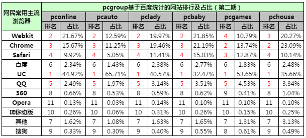

# APP推广位如何绕过UC浏览器的广告屏蔽插件？
UC浏览器默认会在设置中开启广告过滤功能，该功能会屏蔽页面中的广告以及APP推广位置，这给我们的推广带来了很大的阻碍。
而且，UC浏览器在六网中占有很大的比重，因此，这是我们不得不面对的问题。

以下是2015年12月05日~2015年12月11日的百度统计数据：

那么，在写APP推广位时，我们该如何绕过广告屏蔽插件呢？请遵循以下几点：

+ APP推广位统一由js出
+ 用随机类名创建样式并写入 类名下级元素不要再是类名 用标签区分
+ HTML结构也是用js创建写入
+ 一些会导致屏蔽的关键字比如"下载"，"app"，"download"之类，用unicode编码，然后再用空元素隔开
+ 插入结构初始化时，设置 xxx.setAttribute("style","display:block!important;")
+ 不要用a链接跳到下载页面，用js跳
+ 独立成一个js文件，异步加载【因为uc的屏蔽规则在不断调整，我们也需要不断做出应对，方便修改和更新】

具体代码请参考[【DEMO】](index.html)