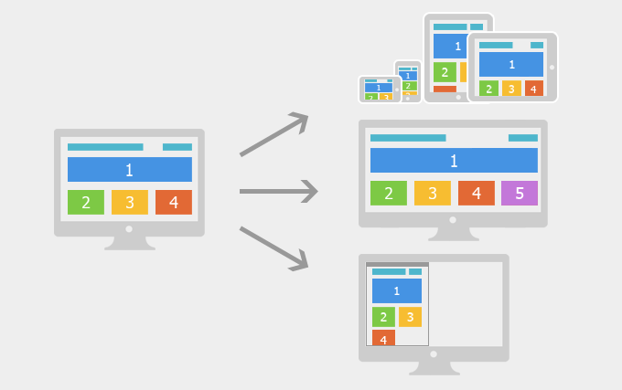
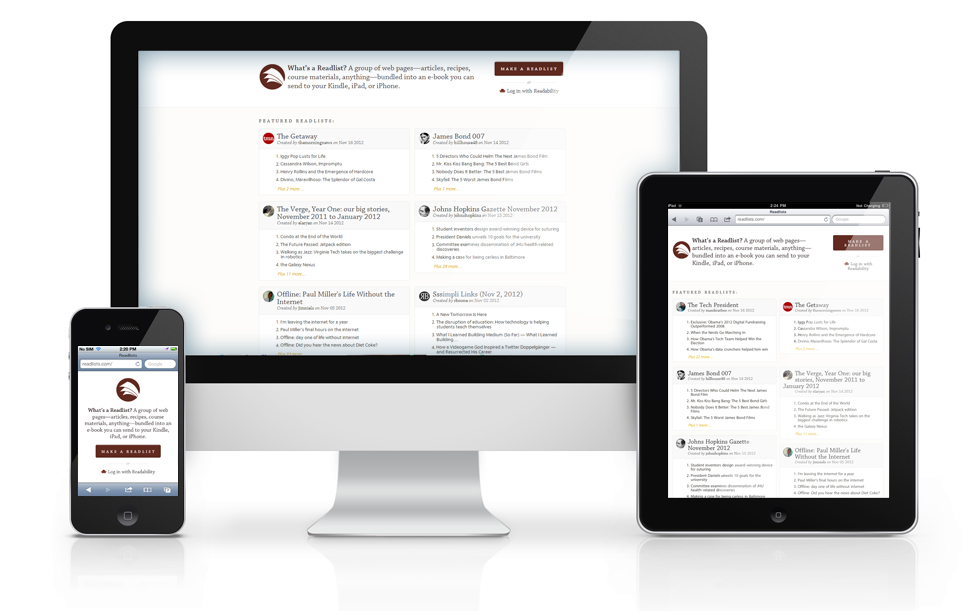
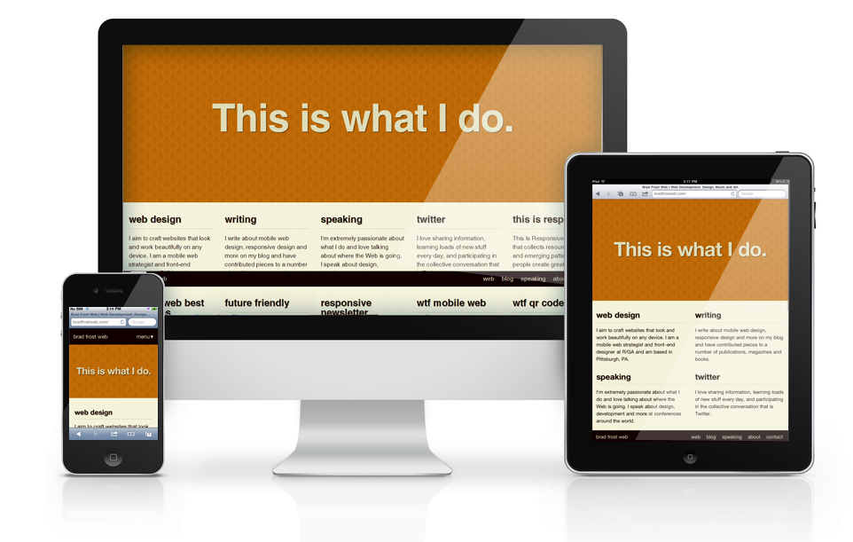

# 网页跨终端方案研究

## 目录
* 前言
* 多模版页面适配
* 响应式设计（侧重点）
* 竞争对手分析
* 响应式设计的技术实现细节
	* 响应式设计基本解决方案&&原理
	* 响应式设计中兼容IE6-8处理
	* 响应式图片
		* CSS背景图片响应式
		* HTML中img标签的图片响应式
	* 响应式设计中多媒体问题
	* 响应式设计中交互式响应
* 响应式设计原则
* 结语
* 资料参考


## 前言
随着智能移动设备、3G和Wifi的普及，越来越多的人使用手机和平板上网。移动设备正超过桌面设备，成为访问互联网的另一个常见终端。

于是，网页设计师和前端开发工程师不得不面对一个难题：如何才能在不同大小的设备上呈现同样的网页？

我们通过调查发现：手机的屏幕比较小，宽度通常在600像素以下，平板的屏幕宽度大概在600~1000之间，PC的屏幕宽度，一般都在1000像素以上(目前主流宽度是1366×768)，有的还达到了2000像素。同样的内容，要在大小迥异的屏幕上，都呈现出满意的效果，并不是一件容易的事。

而针对这种情况，目前业界主要有两种解决方案：


## 方案1：多模版页面适配

这是一种较为成熟的解决方案，具体做法是：为不同的设备提供不同浏览网页版本，大致可分成桌面版、简版、触屏版、Pad版。以太平洋汽车网为例，目前以下这四个版本并存：

* [太平洋汽车网PC桌面版](http://www.pcauto.com.cn/)
* [太平洋汽车网简版](http://m.pcauto.com.cn/w/)
* [太平洋汽车网炫版](http://m.pcauto.com.cn/)
* [太平洋汽车网Pad版](http://ipad.pcauto.com.cn/)

然后，需要额外增加一套设备跳转方案：利用JS或者服务端检测用户访问设备的UA，通过判断UA关键字，从而帮助用户自动跳转到对应的浏览版本。

以太平洋汽车网为例，用户在不同设备访问 http://www.pcauto.com.cn 时，会自动分流跳去对应版本。

**优点：**
* 方案成熟：目前国内大多数网站都采取了这种方式，有很好的借鉴价值，同时，搜索引擎也支持（百度、google都提供了相应的META适配方案）。
* 减少代码量：一种设备一个版本，不需要考虑多终端多设备兼容问题，减少代码量。
* 具有较强的针对性和独立性：各版本都能分别体现出对应设备的优点。比如PC端的屏幕比较大，处理器也比较高级，因此能够放较多内容和一些复杂的页面效果；而手机比较小巧，因此页面较简洁，并且支持触屏事件；而平板屏幕比手机大，并且也支持触屏事件，集合两家之长。

**缺点：**
* 多入口：一个网站有多个URL(入口)，会增加架构设计的复杂度。
* 维护成本：前端开发工程师需要维护多套页面。

**具体实现：**

[【太平洋网络-设备判断跳转方案】](https://github.com/tarymee/deviceJump)


## 方案2：响应式设计(什么是响应式设计)

2010年5月，用户体验设计师Ethan Marcotte提出Responsive Web Design（RWD）的概念，即响应式网页设计，这个概念从Responsive Architecture延伸到web设计领域，让所有的交互设计、视觉、前端开发都开始投入到这个趋势，或者说新的设计解决方案中。

响应式设计理念：页面的设计与开发根据用户行为以及设备环境(系统平台、屏幕尺寸、屏幕定向等)进行相应的响应和调整。通过同比例缩减元素尺寸、调整页面结构布局以及内容的优化调整等方式，使得用户在不同的平台上有着独一无二的用户体验。简言之，响应式设计是一种自适应的设计模式，能灵活地应对不同显示设备的分辨率大小，像台式机，笔记本电脑，手机，平板电脑，平板手机，电子书等。




**优点：**

* 跨平台：在手机，pad，电脑上均有不俗的表现。
* 一个URL：一套页面适应所有设备，易于管理，让用户更容易记，不需要设备跳转和重定向，
* 易于做搜索引擎优化：不需要为移动设备创建特定的内容，可以让移动设备使用桌面网站的搜索引擎优化的好处。
* 节省人力开发成本：不再需要有人特地维护PC页面，移动页面。
* 易于营销：增加销售谈判的砝码，网站可以在移动设备上显示，对营销部门来说，不需要增加额外的工作量

**缺点：**

* 目前国内方案不成熟，实现难度高，开发成本高，需要设计和前端开发人员设计兼容多终端多屏幕
* 代码累赘，为兼容多屏幕多设备会有很多兼容代码（举例触屏焦点图），甚至会出现隐藏无用的元素的情况（手机端可能会隐藏多余的导航或者侧边栏），加载时间加长，在网速较慢的情况下体验不好（重要的是国内目前主流还是2G网络）。
* 其实这是一种折衷性质的设计解决方案，多方面因素影响而达不到最佳效果（比如广告问题）

**例子：**

[响应式设计DEMO](./index.html)

[http://readlists.com/](http://readlists.com/)<br />


[http://bradfrostweb.com/](http://bradfrostweb.com/)<br />


[http://www.bostonglobe.com/](http://www.bostonglobe.com/)<br />


## 竞争对手分析

### 以下列举几个国内较知名的网站以及竞争对手，经过调查分析，我们制作了以下这张表

| 网站/方案 | 多模版适配 | 响应式设计 | 备注说明 |
| ---- | ---- | ---- | ---- |
| 汽车之家 | &radic; |  | 3套多模版(PC，平板和手机，Symbian) |
| 中关村 | &radic; |  | 3套多模版(PC，平板和手机，Symbian) |
| GQ男士网 | &radic; |  | 2套多模版(PC，平板和手机) |
| 太平洋电脑网 | &radic; |  | 4套多模版(PC，平板，手机，Symbian) |
| 太平洋汽车网 | &radic; |  | 4套多模版(PC，平板，手机，Symbian) |
| 太平洋亲子网 | &radic; |  | 3套多模版(PC，平板和手机，Symbian) |
| 太平洋时尚网 | &radic; |  | 4套多模版(PC，平板和手机，Symbian) |
| 新浪时尚 |  | &radic; | 响应式不兼容IE |
| 3G时尚 |  | &radic; | 响应式不兼容IE |
| 爱卡汽车 | &radic; | &radic; | 2套多模版(PC，平板和手机) 响应式不兼容IE |
| 一淘网 | &radic; | &radic; | 2套多模版(PC和平板，手机) 响应式兼容IE |


### 下面是详细分析报告

#### [汽车之家](http://www.autohome.com.cn/)

* 手机第一次访问PC端首页的时候会跳到一个中转页，让用户选择需要访问电脑板或者触屏版，用户选择了之后会对用户的选择做cookies记录，下次访问的时候就自动跳转。
* 汽车之家目前没有做响应式，而是采取了第一种方案，即多模版页面适配的做法。
* 总结：汽车之家目前做了三套多模版的网站，即PC版（桌面版和Pad版），触屏版（也就是我们的炫版），简版（塞班等低端手机和浏览器）。判断用户UA然后跳去对应的版本。

#### [中关村](http://www.zol.com.cn/) && [GQ男士网](http://www.gq.com.cn/) && [太平洋电脑网](http://www.pconline.com.cn/) && [太平洋汽车网](http://www.pcauto.com.cn/)

* 跟汽车之家大体一样
* 不一样的地方是少了让用户选择的中转页，自动跳转去对应到版本。

#### [太平洋亲子网](http://www.pcbaby.com.cn/) && [太平洋时尚网](http://www.pclady.com.cn/)

* 同样是应用多模版页面适配方案。
* 但是，与其他网站不一样的是：用户用多终端设备访问页面时会在本页面弹窗让用户选择将要跳去的版本，并且记录cookie，在下一次访问时检测到有cookie时才会自动跳转。
* 说明：这样有利于百度SEO的优化，百度的技术人员曾经与我们公司的SEO技术人员透露，利用JS检测UA手段跳去对应版本的做法有可能在不久的将来遭遇百度算法的打击降权。


### 业内目前实现响应式的网站大体有以下几个：

#### [新浪时尚](http://fashion.sina.com.cn/)、[3G时尚](http://fashion.3g.cn/)

* 在IE6-8不做任何处理，焦点图等动态图片在IE下的脚本执行还存在一些问题（测试版本IE8）
* 仅做到视觉响应式，也照顾到交互的响应式。
* 在移动端兼容良好
* 广告以图片图片为主，falsh不支持。
* 总结：这是专门为高级浏览器做的响应式页面。
* 说明：诺基亚WP手机的IE浏览器最低版本是IE9，而安卓和苹果手机浏览器内核都是webkit，都支持CSS3的Media Query属性，因此能够兼容多终端设备。

#### [爱卡汽车](http://www.xcar.com.cn/)

* 2014年7月宣称推触屏版2.0，采用全新响应式设计，使得一个站点能够兼容多个终端。[点击查看新闻](http://wireless.iresearch.cn/app/20140710/234267.shtml)
* 具体方案是：用户用智能移动设备访问爱卡汽车的首页[http://www.xcar.com.cn/](http://www.xcar.com.cn/)时，会检测并自动跳转到[触屏版2.0](http://a.xcar.com.cn/)，触屏版2.0兼容了平板以及手机多种屏幕和尺寸。但是，它并没有对低端手机(Symbian)提供简版的支持，依然停留在Pc版。
* 总结：爱卡汽车目前做了两套多模版的网站，即PC版（桌面版），触屏版2.0（兼容平板和手机），不支持低端设备。

#### [一淘网](http://www.etao.com/ "一淘网")

* PC端的页面做了视觉响应式，但是不兼容手机端小屏幕，而是这样分的：750px-1009px为平板、1010px-1219px为Pc端窄屏、大于1220的为Pc端宽屏幕。
* 没有同步做到交互的响应式和图片的响应式。
* 在IE6-8上做到了兼容
* 广告方面都不涉及到flash处理
* 用手机访问PC端页面会跳去[一淘网触屏版](http://m.etao.com/#!/entry/index.php "一淘网触屏版")
* 总结：手机端的适配采用多模版适配方案，而在PC端和平板上的多屏幕适配采用响应式设计方案（两种方案的结合）。


## 响应式设计的技术实现细节
按照目前的移动设备和提供的浏览网页版本，响应式设计可以根据设备屏幕宽度大致分成三个区分区间：320px-749px为手机、750px-999px为平板，大于1000px为Pc端。

PS：不一定这么分，不同的项目要根据需求来做决定。比如[一淘](http://www.etao.com/ "一淘")的响应式设计，不兼容手机端，而是这样分的：750px-1009px为平板、1010px-1219px为Pc端窄屏、大于1220的为Pc端宽屏幕。


### 响应式设计基本解决方案&&原理
那么，如何根据设备宽度来实现不同设备宽度响应式呢？

首先，在页面加viewport元标签，使页面在移动设备上显示的宽度等于设备宽度。
```html
<meta name="viewport" content="width=device-width,initial-scale=1.0,maximum-scale=1.0,user-scalable=no"/>
```
"自适应网页设计"的核心，就是CSS3引入的[Media Query](http://www.blueidea.com/tech/web/2010/7912.asp "Media Query")模块。
它能自动探测屏幕类型，尺寸宽度等属性，然后加载相应的CSS，支持外链和内联样式

```html
<link rel="stylesheet" type="text/css" href="style.css" media="screen and (min-width: 400px)">
<style>
.mod{width:100px;}
@media only screen and (min-width: 400px){
	.mod {width:400px;}
}
</style>
```
上面代码的意思是检测到屏幕宽度大于等于400px时，加载style.css，然后改成mod的宽度值。


### 响应式设计中兼容IE6-8处理

```html
<style>
*{margin:0px;padding:0px;}
.content{width:100%;height:5000px;background:#f60;}
@media (min-width:320px) and (max-width:749px){
	.content{background:red;}
}
@media (min-width:750px) and (max-width:999px){
	.content{background:blue;}
}
@media (min-width:1000px){
	.content{background:black;}
}
.w320 .content{background:red;}
.w750 .content{background:blue;}
.w1000 .content{background:black;}
</style>

<!--[if lte IE 8]>
<script>
(function() {
	function aaa() {
		var w = document.documentElement.clientWidth;
		var b = document.body;
		if (w <= 749) {
			b.className = "w320";
		} else if (750 <= w && w <= 999) {
			b.className = "w750";
		} else {
			b.className = "w1000";
		}
	}
	aaa();
	function addEvent(type,fn) {
		if (window.attachEvent) {
			window.attachEvent("on" + type, fn)
		} else if (window.addEventListener) {
			window.addEventListener(type, fn, false);
		}
	}
	addEvent("resize",aaa);
})();
</script>
<![endif]-->
```


### 响应式图片

响应式图片是指：用户代理根据输出设备的分辨率不同加载不同类型的图片，不会造成带宽的浪费。同时，在改变输出设备类型或分辨率时，能及时加载对应类型的图片。

响应式图片可分成两个部分:

- CSS背景图片响应式
- HTML中img标签的图片响应式


#### CSS背景图片响应式

解决思路：Meta Queries + background-size

我们以一张 logo 的背景图为例，logo 的尺寸为 100\*40px，然后为 .logo 设定一个 100\*40px 的背景图片 logo@1x，

接下来通过 Meta Queries 判断设备的最小显示像素比，如果大于等于1.5的话，为 .logo 设定一张 200\*80px 的背景图片 logo@2x，然后通过设置 background-size 让背景图显示为 logo 该有的尺寸。这里的显示像素比我们选择 1.5 作为阈值，是为兼容除苹果以外的高分辨率设备，比如三星的 Android Pad。

代码如下
```css
.logo{
	width:100px;
	height:40px;
	background-image:url(./logo@1x.png);/* 普通屏幕用一倍图 */
}

/* ------------- Retina ------------- */
@media only screen and (-webkit-min-device-pixel-ratio: 1.5), /* Webkit */
	only screen and (min--moz-device-pixel-ratio: 1.5), /* Firefox 16 之前 注意这里的写法比较特殊 */
	only screen and (-o-min-device-pixel-ratio: 3/2), /* Opera */
	only screen and (min-device-pixel-ratio: 1.5) { /* 标准 */
	.logo {
		background-image: url(./logo@2x.png);/* 高清屏幕用二倍图 */
		-webkit-background-size:100px auto;
		-moz-background-size:100px auto;
		background-size:100px auto;
	}
}
```


#### HTML中img标签的图片响应式
目标：页面在初始化以及onresize的时候，页面可以根据设备宽度自适应加载不同尺寸的图片，并且实现按需加载

思路：页面中不写img标签，换成如下的html代码，页面初始化时遍历页面元素，获取有data-picture属性的div标签，然后根据这个div的子元素对应的data-media属性，把图片的src地址存入数组，之后创建img元素替换掉这个div，然后再根据按需加载规则和响应式规则赋予相应的src地址。

```html
<div data-picture data-alt="图片说明">
	<div data-media="(min-width:320px) and (max-width:749px)" data-src="普屏炫版图片.jpg 1x, 高清屏炫版图片.jpg 2x"></div>
	<div data-media="(min-width:750px) and (max-width:999px)" data-src="普屏Pad版图片.jpg 1x, 高清屏Pad版图片.jpg 2x"></div>
	<div data-media="(min-width:1000px)" data-src="普屏桌面版图片.jpg 1x, 高清屏桌面版图片.jpg 2x"></div>
	<div data-media="lazy" data-src="loading占位图.jpg"></div>
	<noscript></noscript><!-- 假如浏览器不执行js的话出默认图片 -->
</div>
```

### 响应式设计中多媒体问题

响应式设计中的一个问题就是横幅广告（动画横幅、互动式横幅）和视频不是流式的
目前只有静态横幅广告和显示广告（如右侧栏广告），是可以跨平台的。

**目前各大公司并没有这方面的尝试和案例，不过业内的一些解决方法有：**

* 可以为智能手机和基本的移动设备提供不同的广告尺寸格式。
* 可以为不同平台使用不同的着陆页URL
* 用AJAX 显示一个页面上的不同广告变体。


### 响应式设计中交互式响应

响应式设计中关于Slider焦点图切换处理
目标：页面在初始化以及onresize的时候，Slider焦点图能根据设备宽度进行自适应调整

**目前的解决思路有两种：**

- 每次resize事件的时候 重新创建一遍对象 然后将旧有的对象 清空删除（此方法存在性能问题 不可取）
- 修改插件 新增一个对外部开放的onresize的callback方法，在进行resize操作的时候，对Slider焦点图大小以及内部options值进行修正。

## 响应式设计原则
响应式设计中我们要遵循哪些原则？

1.在响应式网页设计中，有时候我们需要对页面内容进行删减，按照优先级显示内容，只显示高优先级内容是原则之一。在屏幕较小的移动设备上应该优先考虑内容并且去移掉那些小的栏目。在顶部显示高优先级内容，即把最重要的内容放置在顶部。导航是否一定要出现在页头或者重新布局改在页尾都要依网站具体规划去考虑。

2.提供清晰和友好的手指操作链接。尤其在手机设备上，可点击操作的区块不宜过小，引导要清晰强烈，不忽略任何一款设备。

3.调整设计来适应可用空间，使得用户在不同的设备上仍保持对同一页面相同的视觉和感觉。这也遵循我们交互设计体验一致的原则。

4.需考虑大部分用户右手点击操作，左手负责握住设备的习惯，右侧的导航列表既方便右手的点击，又可以避免被握着设备的左手不小心触碰到。


## 结语
响应式对工程师有美学要求，对设计师有工程要求，需要有跨学科综合工程能力的人，这对团队所有的人都提出了更高的要求和挑战，这样的人才培养和积累都还需要一定得时间。

业内大型网站如 支付宝、天猫、腾讯 都不是响应式网站，这是因为目前国内的现状分两类:
其一，正在做，在尝试中。
其二，历史原因太重单单靠前端团队推动不了。

如果抛开IE6-8的历史兼容问题，响应式设计现阶段已有成熟的框架和解决方案，如[bootstrap](http://www.bootcss.com/)，目前是一些中小型公司，较为简单的页面在使用。


综上所述: 让我们意识到,响应式涉及到到一个公司的定位问题，并不适合所有人，但应该是多设备多屏幕时代的一个到来。我们可以在一些中小型项目中运用类似技术，为未来的互联网的发展和机遇，做好准备。


## 资料参考


[http://www.qianduan.net/responsive-web-design.html](http://www.qianduan.net/responsive-web-design.html)<br />
[http://www.uisdc.com/pop-responsive-design](http://www.uisdc.com/pop-responsive-design)<br />
[http://www.uisdc.com/responsive-nav](http://www.uisdc.com/responsive-nav)<br />
[https://github.com/kissygalleryteam/responsive](https://github.com/kissygalleryteam/responsive)<br />
[https://github.com/kissygalleryteam/responsive/blob/master/1.0/guide/mediaquerypolyfill.md](https://github.com/kissygalleryteam/responsive/blob/master/1.0/guide/mediaquerypolyfill.md)<br />
[http://ux.etao.com/posts/687](http://ux.etao.com/posts/687)<br />
[http://www.bootcss.com/p/bsie/](http://www.bootcss.com/p/bsie/)<br />
[http://ued.alimama.com/posts/686](http://ued.alimama.com/posts/686)<br />
[http://www.w3cplus.com/responsive/understanding-responsive-web-design-cross-browser-compatibility.html](http://www.w3cplus.com/responsive/understanding-responsive-web-design-cross-browser-compatibility.html)<br />
[http://lusongsong.com/info/post/158.html](http://lusongsong.com/info/post/158.html)<br />
[http://mutian.info/tech/1386](http://mutian.info/tech/1386)<br />
[http://ued.taobao.com/blog/2013/01/css-and-html5-adaptive-images/](http://ued.taobao.com/blog/2013/01/css-and-html5-adaptive-images/)<br />


